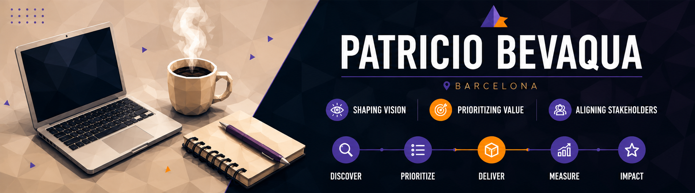

  

<h3 align="center">
  Product Owner · Functional Analyst · Digital Project Manager
</h3>

  Conecto negocio, procesos y equipos técnicos para convertir problemas complejos
  en productos digitales claros, priorizables y utilizables.

  <a href="https://patricio-bevaqua.pages.dev/" target="_blank" rel="noopener noreferrer">
    <strong>Explorar casos reales →</strong>
  </a>

---

### En qué aporto valor

| Producto | Análisis funcional | Entrega |
| --- | --- | --- |
| Discovery y definición | Reglas de negocio y requisitos | Backlog, criterios y coordinación |
| Prioridad y alcance | Procesos complejos | Validación y mejora continua |

### Casos seleccionados

<ul>
  <li>
    <a href="https://patricio-bevaqua.pages.dev/casos/procedimiento-a-producto.html" target="_blank" rel="noopener noreferrer">
      Procedimiento → producto
    </a>
  </li>
  <li>
    <a href="https://patricio-bevaqua.pages.dev/casos/liquidacion-final.html" target="_blank" rel="noopener noreferrer">
      Rediseño end-to-end
    </a>
  </li>
  <li>
    <a href="https://patricio-bevaqua.pages.dev/casos/reporting-multiconvenio.html" target="_blank" rel="noopener noreferrer">
      Reporting multiconvenio
    </a>
  </li>
</ul>

---

### Contacto

<a href="https://www.linkedin.com/in/patricio-bevaqua/" target="_blank" rel="noopener noreferrer">LinkedIn</a>
·
<a href="https://patricio-bevaqua.pages.dev/" target="_blank" rel="noopener noreferrer">Portfolio</a>
